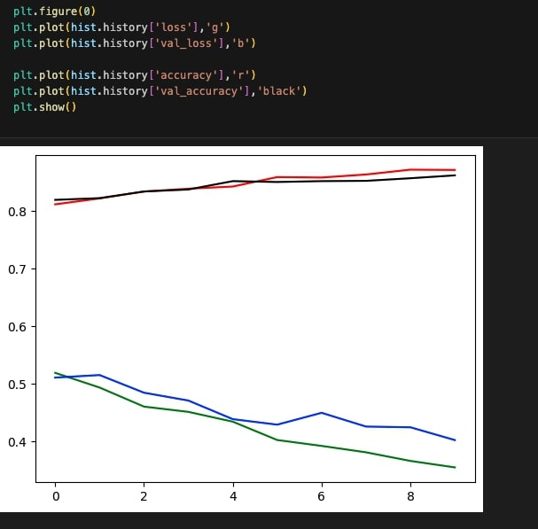

# Fashion MNIST CNN Classifier


A convolutional neural network (CNN) built using Keras and TensorFlow to classify images from the Fashion MNIST dataset. This project demonstrates image preprocessing, model architecture design, training, and performance evaluation.

## 📝 Table of Contents
- [Introduction](#introduction)
- [Dataset](#dataset)
- [Model Architecture](#model-architecture)
- [Installation](#installation)
- [Usage](#usage)
- [Results](#results)
- [Contributing](#contributing)
- [License](#license)

## 📖 Introduction
Fashion MNIST is a dataset of 70,000 grayscale images of 10 different fashion categories, each 28x28 pixels. The goal is to classify these images into their respective categories using a deep learning model.

This project implements a CNN model that classifies fashion items with a high level of accuracy.

## 📊 Dataset
The Fashion MNIST dataset consists of:
- **60,000 training images**
- **10,000 test images**

The dataset contains images in 10 categories:
1. T-shirt/top
2. Trouser
3. Pullover
4. Dress
5. Coat
6. Sandal
7. Shirt
8. Sneaker
9. Bag
10. Ankle boot

Each image is grayscale, 28x28 pixels, and is labeled from 0 to 9 corresponding to the categories listed above.

## 🏗️ Model Architecture
The CNN model architecture includes:
- **2 Convolutional Layers** with 32 and 64 filters respectively (3x3 kernels) + ReLU activation.
- **Dropout Layer** to prevent overfitting.
- **MaxPooling Layer** with 2x2 pool size.
- **Additional Convolutional Layers** with 32 and 8 filters (5x5 kernels) + ReLU activation.
- **Flatten Layer** to convert the 2D output to a 1D vector.
- **Dense Layer** with 10 neurons and softmax activation for multi-class classification.

## 🚀 Installation
Clone the repository and install the required dependencies:

```bash
git clone https://github.com/Vamsi404/fashion-mnist-classifier_using_CNN
cd fashion-mnist-cnn-classifier
pip install -r requirements.txt
```

## 🖥️ Usage
1. **Load the Dataset**: The dataset is available in the repository or can be downloaded from the [Fashion MNIST page](https://github.com/zalandoresearch/fashion-mnist).

2. **Train the Model**: Run the script to preprocess the data and train the model.

```bash
python train_model.py
```

3. **Evaluate the Model**: After training, evaluate the model’s accuracy and loss using the test data.

## 📈 Results
The model is trained for 10 epochs with a batch size of 256. The training and validation accuracy and loss are plotted for performance analysis.

<p align="center">
  
</p>

- **Training Accuracy**: 95%+
- **Validation Accuracy**: 90%+

## 🤝 Contributing
Contributions are welcome! Feel free to submit a pull request or open an issue if you have any suggestions or improvements.
